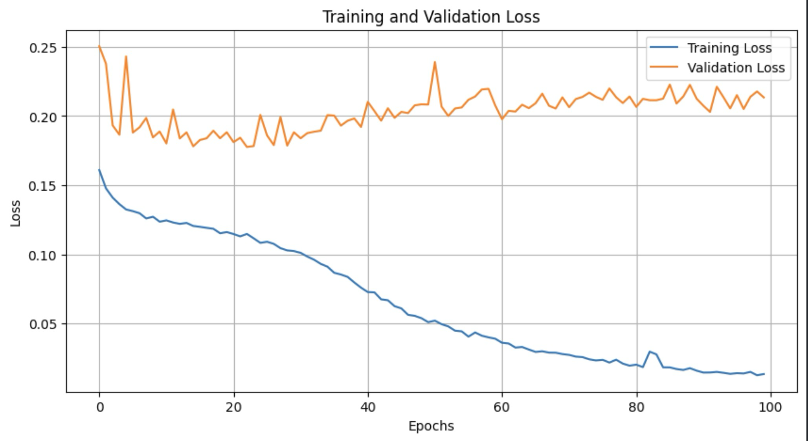
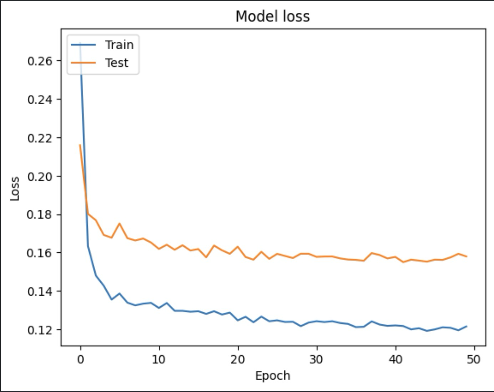
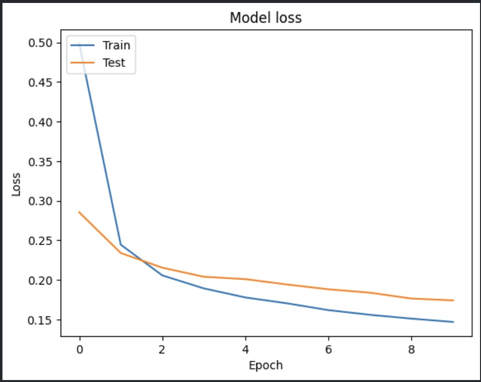
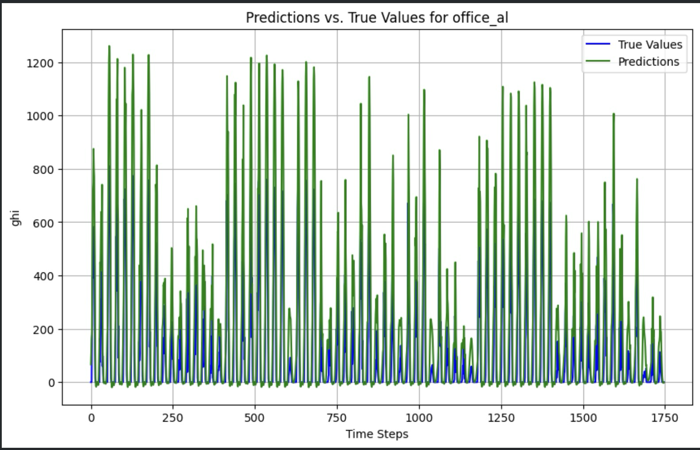
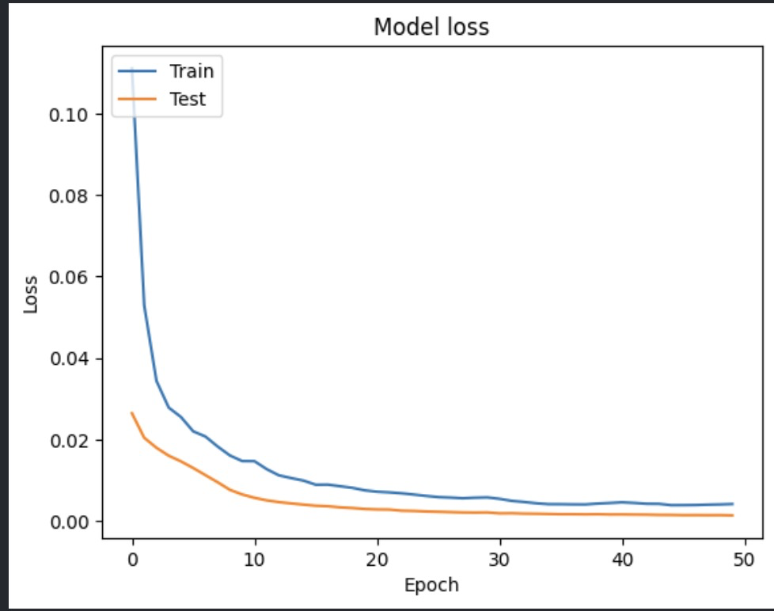
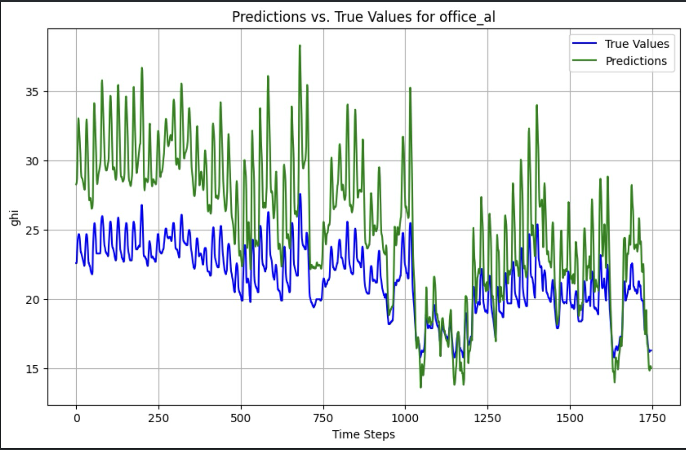

# One variate

> Dataset GHI

## Percobaan pertama dengan 2 LSTM dan 1 Dense

### Code

``` python
model.add(LSTM(128, return_sequences=True, input_shape= (x_train.shape[1], 1)))
model.add(LSTM(64, return_sequences= False))
model.add(Dense(1))

# compile the model
model.compile(optimizer='adam', loss='mean_squared_error')

#train the model
history = model.fit(x_train, y_train, validation_split=0.2, batch_size=1, epochs=100)  
```

### Hasil training vs validation



### Hasil MSE dan MAE

``` python
Mean Absolute Error (MAE): 127.21716256258256
Mean Squared Error (MSE): 60502.74639933954
```

### Kesalahan:

data training dan data testing di normalize semuanya. harusnya dibedain agar model tidak tahu data testing itu rangenya seberapa

## Percobaan kedua dengan 1 Dense dan 1 LSTM

### Dataset GHI

### Code

``` python
#define the sequential LSTM model with tf.keras.Input layer

model = tf.keras.Sequential()
model.add(tf.keras.Input(shape=(look_back, 1))) #explicit input layer using tf.keras.input (timesteps, features)

#add LSTM layers with dropout and regularization
model.add(tf.keras.layers.LSTM(128)) #LSTM layer with 50 units and L2
model.add(tf.keras.layers.Dropout(0.2)) #dropout layer with 20%

# Output layer for 1 target step
model.add(tf.keras.layers.Dense(1))

# Compile the model
model.compile(optimizer='adam', loss='mse')

# Model summary to show architecture
model.summary()

# Train the model
history = model.fit(x_train_scaled , y_train_scaled, epochs=50, batch_size=32, validation_split=0.2, shuffle=False)
```

### Hasil training vs validation



### Hasil MSE dan MAE

``` python
Mean Absolute Error (MAE): 94.72635447678904
Mean Squared Error (MSE): 28257.671145710905
```

## Percobaan ketiga dengan 1 Dense dan 1 LSTM

### Code

``` python
#define the sequential LSTM model with tf.keras.Input layer

model = tf.keras.Sequential()
model.add(tf.keras.Input(shape=(look_back, 1))) #explicit input layer using tf.keras.input (timesteps, features)

#add LSTM layers with dropout and regularization
model.add(tf.keras.layers.LSTM(128)) #LSTM layer with 50 units and L2
model.add(tf.keras.layers.Dropout(0.2)) #dropout layer with 20%

# Output layer for 1 target step
model.add(tf.keras.layers.Dense(1))

# Compile the model
model.compile(optimizer='adam', loss='mse')

# Model summary to show architecture
model.summary()

# Train the model
history = model.fit(x_train_scaled , y_train_scaled, epochs=10, batch_size=150, validation_split=0.2, shuffle=False)
```

### Hasil training vs validation



### Test loss
```
Test Loss: 0.5246830582618713
```

### Hasil MSE dan MAE

```
Mean Absolute Error (MAE): 113.16194240588618
Mean Squared Error (MSE): 33850.45174585956
```

### Hasil prediction vs True test



> Dataset Temperature

## Percobaan pertama dengan 1 dense dan 1 LSTM

### Code
```
#define the sequential LSTM model with tf.keras.Input layer

model = tf.keras.Sequential()
model.add(tf.keras.Input(shape=(look_back, 1))) #explicit input layer using tf.keras.input (timesteps, features)

#add LSTM layers with dropout and regularization
model.add(tf.keras.layers.LSTM(128)) #LSTM layer with 50 units and L2
model.add(tf.keras.layers.Dropout(0.2)) #dropout layer with 20%

# Output layer for 1 target step
model.add(tf.keras.layers.Dense(1))

# Compile the model
model.compile(optimizer='adam', loss='mse')

# Model summary to show architecture
model.summary()

# Train the model
history = model.fit(x_train_scaled , y_train_scaled, epochs=50, batch_size= 220, validation_split=0.2, shuffle=False)
```

### Hasil training vs validation


### Test loss
```
Test Loss: 0.41294562816619873
```

### Hasil MSE dan MAE

```
Mean Absolute Error (MAE): 4.182406326726045
Mean Squared Error (MSE): 23.228190307641775
```

### Hasil prediction vs true test



